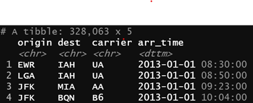

```{r setup, include=FALSE}
knitr::opts_chunk$set(echo = TRUE)

library(lubridate)
library(tidyverse)
library(nycflights13)
```


>**Question 1**

Use and show R coding to find the number of days from June 6th 2020 to July 14th 2021

## Solution
```{r}
first_date <- ymd("2020-06-06")
second_date <- ymd("2021-07-14")

# Number of days
(first_date %--% second_date) %/% days(1)
```


>Question 2

Use and show R coding to confirm that the year 1988 was a leap year.

## solution
```{r}
leap_year(1988)
```


### Question 3
Use and show R coding to confirm that the year 1989 was not a leap year.

## Solution
```{r}
leap_year(1989)
```


### Question 4
Why is there months() but no dmonths ? (Answer in 3 to four sentences)

## Solution
Months would have differing results when expressed in form of time because there are differing numbers of days in a month, some months have 30 days, others have 31 days, yet a month like February has 28 days (and 29 days in a leap year).


### Question 5
John was born April 11th, 1962. Use and show R coding to determine how old John is in years

## Solution

```{r}
john_bday <- ymd("1962-04-11")
(john_bday %--% today()) %/% years(1)
```


### Question 6
Modify the flights_dt coding in the notes or the book to obtain the following partial data table shown below.  Show all required coding. (Most of the coding needed is provided in the notes)

## Solution

```{r}
make_datetime_100 <- function(year, month, day, time) {
  make_datetime(year, month, day, time %/% 100, time %% 100)
}

flights_dt <- flights %>% 
  filter(!is.na(dep_time), !is.na(arr_time)) %>% 
  mutate(
    dep_time = make_datetime_100(year, month, day, dep_time),
    arr_time = make_datetime_100(year, month, day, arr_time),
    sched_dep_time = make_datetime_100(year, month, day, sched_dep_time),
    sched_arr_time = make_datetime_100(year, month, day, sched_arr_time)
  ) %>% 
  select(origin, dest, carrier, arr_time, dep_time)
  
flights_dt 
```


### Question 7
Now, using your table from #6, produce the frequency plot shown which conveys frequency counts for the months of April, July, and October for the year 2013.


## Solution
```{r}
flights_dt %>% 
  filter(
    !is.na(dep_time),
    year(dep_time) == 2013, 
    month(dep_time) >= 4 & month(dep_time) <= 10) -> lights_dt_filt

lights_dt_filt %>% 
  ggplot(aes(dep_time)) +
  geom_freqpoly(bins = 94) +
  scale_y_continuous(breaks = seq(0, 2500, by = 500))
```


### Question 8
Now use dplyr functions to produce a data table that shows arrival times for American Airlines at the Dallas Fort Worth Airport from the LaGuardia airport in New York. Your output should show rows 115 to 125.
A partial table is provided below. 


## Solution

```{r}
flights_AA <- flights_dt %>% 
  filter(origin == "LGA",
         dest == "DFW",
         carrier == "AA") %>% 
  select(-dep_time) %>% 
  slice(115:125) %>% 
  arrange(arr_time)
flights_AA
```


### Question 9
Using the first two observational date time designations from your #8 table, Use and show R code to confirm that there are 181 minutes time intervals between them.


## Solution
```{r}
flights_AA %>% 
  select(arr_time) %>% 
  head(2) %>% 
  mutate(arr_time = as_datetime(arr_time)) -> flights_AA_2

dminutes(flights_AA_2[2, 1] - flights_AA_2[1, 1])

```
